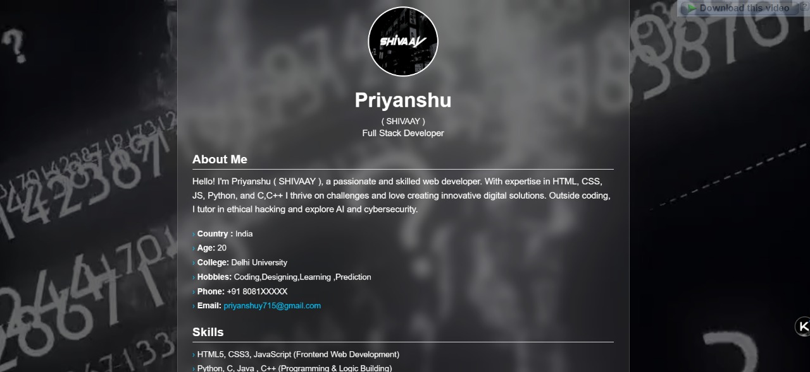
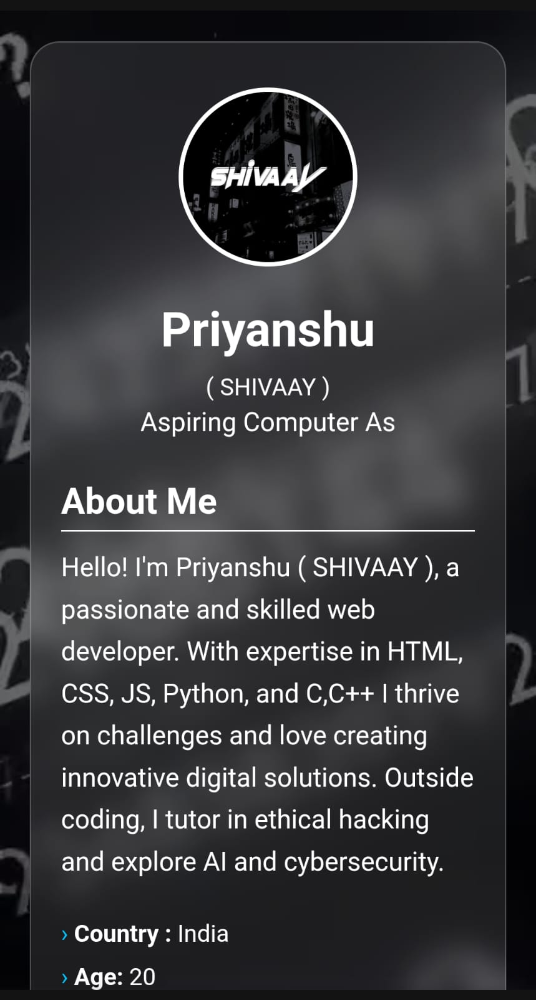

# 🚀 Priyanshu (Shivaay)'s Developer Portfolio 🌐


---

> ✨ A fully responsive, modern, and elegant portfolio website built by **Priyanshu (Shivaay)** – an aspiring Computer Scientist, Ethical Hacker & Web Developer from **Azamgarh, India**.

---

## 🔗 Live Preview

🚀 [Click Here to Visit My Portfolio](https://shivaay20005.github.io/shivaay2005/)  
📬 Connect with me on [Telegram](https://t.me/Shivaay20005)

---

## 📸 Screenshots

| 💻 Desktop View | 📱 Mobile View |
|----------------|----------------|
|  |  |

---

## 👨‍💻 About Me

> I'm **Priyanshu (aka Shivaay)** – a passionate **Web Developer**, **Cybersecurity Enthusiast**, and **Ethical Hacking Tutor**. With strong foundations in **HTML, CSS, JavaScript, Python, C, and C++**, I strive to build secure, creative, and impactful digital experiences.

---

## 🧰 Tech Stack

- ✅ HTML5, CSS3, JavaScript  
- ✅ Python, Java, C, C++  
- ✅ MySQL, GitHub, VS Code  
- ✅ Telegram Bot Development  
- ✅ Ethical Hacking & Network Security  
- ✅ Responsive Web Design & UI/UX

---

## 🌟 Portfolio Features

- 🎥 **Video Background** – Smooth and engaging video UI  
- ⚡ **Typing Animation** – Attention-grabbing auto-text feature  
- 📁 **Skills & Experience Sections** – Displays your tools & journey  
- 📱 **Fully Responsive** – Works seamlessly on all devices  
- 💬 **Telegram Integration** – Direct messaging through Telegram  
- 🌌 **Dark Overlay Effects** – Stylish and easy-on-eyes  
- 🔐 **Cybersecurity Highlight** – Showcases hacking & network skills  

---

## 🛠️ Installation & Setup Guide

### ✅ Prerequisites

- Ensure **Git** is installed on your system  
  🔗 [Download Git](https://git-scm.com/downloads)

---

### 🚀 Steps to Run Locally

1. **Clone the repository:**
   ```bash
   git clone https://github.com/Shivaay20005/shivaay-portfolio.git
